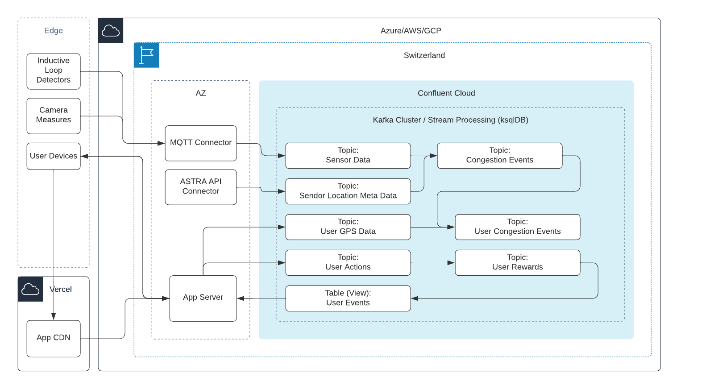

# Overview

## Inspiration

Time is our most valuable asset and spending time in traffic jams is not just bad for you, but also bad for the environment. As users of the Swiss road system and as admirers of the beautiful environment of Switzerland, we have a deep desire to make an impact to improve the current situation.

## What it does

Drivers on Swiss roads spend endless hours in traffic jams. Existing Map apps from Google or Apple lack the data and featuers do properly fight congestions in areas with high traffic peaks and limited options for alternative routes. Often, rerouting traffic even creates additional traffic jams in areas that were not built for high throghput.

Our app uses sensor data from inductive loop detectors and road cameras to get a more comprehensive view of the road state and combine it with GPS data of individual drivers in real-time. With gamification and our own reward system we incentivise the drivers to follow our recommended action and therefore help to avoid congestion all-together.

## How we built it

Real-time data streaming is at the heart our our application. Prediction is useful to get an approximation of a future state but any system that is based on patterns of the past is fragile to the unpredictability of the future.

As a team we spent the first hours brainstorming the problem statement and possible solutions. We clustered our ideas and set the focus, selecting the most impactful usecases. Using a lean gamification canvas we identified how to incentivise drivers to adopt better behaviour.

After creating a joint plan for success, we have split the work into UI, backend and platform development, while continuing to research possible optimization in traffic management.

Our presentation layer is a progressive web app running on the users phone, serving the end user and feeding back GPS data. It is build with Next.js and deployed to the Vercel edge.

Our data platform uses Apache Kafka in combination with stream processing. It is based on Confluent Cloud which enables us to run at massive scale and achieve the troughtput and latency we would need to make recommendation that are actually based on real-time data. 

(JamHero target architecture)

## Challenges we ran into

building a good prediciton model would need more inputs
real-time data would still be needed to get the best results
many discussions, evaluation etc

## Accomplishments that we're proud of

good decision
real-time data streaming
app that shows the gist 

## What we learned

Our use cases mostly build on real-time data streaming, reacting to events that happen on the street, rather than using a prediction model. As part of our use case dicussion we have worked out cases that would build on prediction in combination with real-time data, but have rated those as less useful. To better understand our decision process have a look at our [inception](inception.md) docs.

## What's next for AstAIn
To the moon

## Built With

LOVE, ...

Written by a real human.

